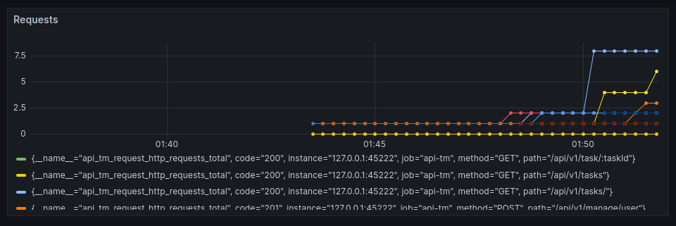

## Run / Build

---

Run only

```shell
make run
```

Build only

```shell
make build
```

## Docker-compose

---

```shell
make c.build
```

```shell
make c.up
```

## Docs

---

http://127.0.0.1:45222/doc/index.html

## Tests

---

```shell
make tests
```

## Metrics

---

### Prometheus

```yaml
# prometheus.yml

- job_name: api-tm
  scrape_interval: 15s
  static_configs:
    - targets:
      - 127.0.0.1:45222
```

**api_tm_request_http_requests_total** - total number of requests, their methods and paths.



## Files

- _docs/*_ - swagger files(OpenAPI)
- _configs/conf.toml_ - settings
- _scripts/create_tables.sql_ - postgres tables 
- _logs/app.log_ - api errors 

## Manual run / building / generation

---

#### OpenAPI(generation)

```shell
swag init -g cmd/app/main.go
```

#### Tests

```shell
go test -failfast ./...
```

#### Run only

```shell
go run cmd/app/main.go
```

#### Build and run

```shell
go build -o apitm cmd/app/main.go
```

```shell
./apitm
```

#### Docker(local DB)

```shell
docker build . -t apitm:v0.1
```

```shell
docker run --rm --network=host apitm:v0.1
```

#### Docker-compose

```shell
docker-compose build
```

```shell
docker-compose up
```